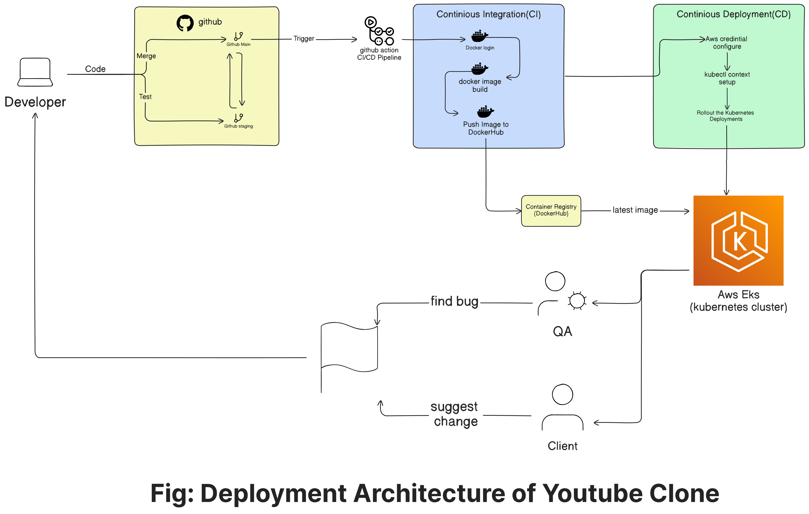

# Youtube Clone Deployment full documentation

## Stage 1: Source Code Management

1. I found the YouTube clone application from the following GitHub repositories:
    - Frontend: https://github.com/manikandanraji/youtubeclone-frontend
    - Backend: https://github.com/manikandanraji/youtubeclone-backend
2. I cloned both repositories into a single root folder named `youtube` and removed the `.git` directories from both the backend and frontend.
3. Then, I created a new repository on my own GitHub: https://github.com/janisadhi/youtube.git.
4. I removed the `.git` folder from both the frontend and backend, then initialized a separate Git repository in the root directory `youtube`. After that, I created the main branch, added the remote, and pushed the code to GitHub.

---

## Stage 2: Research and Testing Application Locally

1. I read all the documentation provided in both frontend and backend repositories.
2. First, I created a PostgreSQL database named `youtube` as per the documentation.
3. I ran the frontend locally:
    - Edited the `.env` file:
        - Created a Cloudinary account and added the account ID to the `.env` file as per the documentation.
        - Added the backend API URL.
    - Ran `npm install` and fixed any issues that appeared during the process.
    - Started the frontend using `npm start`.
4. I ran the backend locally:
    - Edited the `.env` file:
        - Added the database URL.
        - Generated and added a JWT secret and JWT expiration.
    - Ran `npm install` and fixed any issues during installation.
    - Started the backend using `npm run dev`.
5. I checked if the application was running properly by testing:
    - Logging in and signing up.
    - Uploading videos.
    - Ensuring all features functioned correctly.

The project was successfully tested locally.

---

## Stage 3: Containerization

1. I created a `.docker` folder in the root directory.
2. Wrote Dockerfiles:
    - **Frontend**:
        - Created a `frontend` folder and wrote the Dockerfile.
        - The first stage uses the Node.js image to install npm packages and build the application. The second stage uses the Nginx image to serve the built application on port 80 with a custom Nginx configuration file.
    - **Backend**:
        - Created a `backend` folder and wrote the Dockerfile.
        - The first stage uses the latest Node.js image to install dependencies and copy the backend source code. The second stage uses a lightweight Node.js Alpine image to run the application on port 5000 with `npm run dev`.
3. **Docker Build**:
    - Built the Docker image for the frontend:
        
        ```bash
        docker build -f .docker/Frontend/Dockerfile -t janisadhi/youtube-frontend:v0.1 .
        
        ```
        
    - Built the Docker image for the backend:
        
        ```bash
        docker build -f .docker/Backend/Dockerfile -t janisadhi/youtube-backend:v0.1 .
        
        ```
        
4. **Test by Running Containers**:
    - Created a network called `youtube`:
        
        ```bash
        docker network create youtube
        
        ```
        
    - Created a PostgreSQL container:
        
        ```bash
        docker run -itd \
        --name postgres \
        -p 5432:5432 \
        --network youtube \
        -e POSTGRES_PASSWORD=<password> \
        -e POSTGRES_DB=youtubeclone \
        postgres:16
        
        ```
        
    - Ran the frontend container:
        
        ```bash
        docker run -itd \
        --name frontend \
        -p 3000:80 \
        --network youtube \
        janisadhi/youtube-frontend:v0.1
        
        ```
        
    - Ran the backend container:
        
        ```bash
        docker run -itd \
        --name backend \
        -p 5000:5000 \
        --network youtube \
        janisadhi/youtube-backend:v0.1
        
        ```
        
    - Accessed the application at [localhost:3000](http://localhost:3000/) and ensured the database URL in the `.env` file looked like this:
        
        ```bash
        postgres://<database-user>:<database-password>@<container-name>:<port>/<database-name>
        
        ```
        
    - Tested all the functionalities including login, signup, and video upload.
5. **Push Docker Images to Docker Hub**:
    - After successfully running the application, I logged into Docker Hub and pushed the images:
        - For the frontend:
            
            ```bash
            docker push janisadhi/youtube-frontend:v0.1
            
            ```
            
        - For the backend:
            
            ```bash
            docker push janisadhi/youtube-backend:v0.1
            
            ```
            

---

## Stage 4: Docker-Compose Deployment Using Ansible in AWS EC2

1. **Write Terraform Code for EC2 Instance Deployment**:
    - Create the EC2 instance along with the security groups and key pair.
    - Place the Terraform configuration inside `.terraform/aws-ec2/` and use the following commands to initialize and apply the Terraform configuration:
        
        ```bash
        terraform init
        terraform apply
        
        ```
        
2. **Write Docker-Compose File**:
    - Create a `docker-compose.yaml` file inside `.docker/` to define the different services (such as network, volume mounts for the database, and other containers).
    - Test the setup manually by running the following command from the root directory:
        
        ```bash
        docker-compose -f .docker/docker-compose.yaml up --detach
        
        ```
        
3. **Write Ansible Playbook for Deployment**:
    - Create an Ansible playbook with different roles inside the `.ansible/` folder. The structure of the folder should be as follows:
        
        ```bash
        .
        ├── inventory.ini
        ├── playbook.yaml
        ├── roles
        │   ├── deploy
        │   │   └── tasks
        │   │       └── main.yaml
        │   └── docker-install
        │       └── tasks
        │           └── main.yaml
        └── sibersegment.pem
        
        ```
        
    - The `inventory.ini` file contains the Ansible host, username, and the secret file for authentication.
    - Ensure that the EC2 instance is accessible with the private key (`sibersegment.pem`), or the public key of the host should be added to the instance’s authorized keys.
    - Run the Ansible playbook with the following command:
        
        ```bash
        ansible-playbook -i inventory.ini .ansible/playbook.yaml
        
        ```
        
4. **Access the Application**:
    - After deploying with Docker Compose and Ansible, access the application by navigating to [http://localhost:3000](http://localhost:3000/).

---

## Stage 5: Continuous Integration and Continuous Deployment Using Docker-Compose and Ansible

### Jenkins Setup

1. **Write Jenkins Pipeline File**:
    - I created a Jenkins pipeline file inside the `.jenkins/` directory. The pipeline file includes the following stages:
        - Source code fetch from GitHub.
        - Docker login to authenticate with Docker Hub.
        - Docker build to build the Docker images for both frontend and backend.
        - Docker push to push the images to Docker Hub.
        - Run the Ansible playbook to deploy the updated Docker containers to AWS EC2.
2. **Setup Jenkins Server**:
    - I added Jenkins secrets for Docker Hub credentials and GitHub credentials to authenticate with these services.
3. **Create Jenkins Pipeline**:
    - In Jenkins, I created a new pipeline job.
    - I enabled the GitHub hook trigger for the pipeline to ensure the CI/CD process starts automatically with every push.
    - I chose "Pipeline script from SCM" as the option.
    - I specified the GitHub repository URL and the path to the Jenkins pipeline file.
4. **Add Webhook in GitHub**:
    - In my GitHub repository, I navigated to **Settings > Webhooks**.
    - I added a webhook with the following URL:
        
        ```
        https://<jenkins-url>/github-webhook
        
        ```
        
    - This webhook triggers the CI pipeline in Jenkins whenever a push operation is made to the GitHub repository.
5. **CI/CD Pipeline Workflow**:
    - When I push changes to the GitHub repository, the GitHub webhook triggers the Jenkins pipeline.
    - The Jenkins pipeline performs the following tasks:
        - **Source code fetch** from GitHub.
        - **Docker login** to authenticate with Docker Hub.
        - **Docker build** to build the Docker images for both frontend and backend.
        - **Docker push** to push the images to Docker Hub.
        - **Run the Ansible playbook** to deploy the updated Docker containers to AWS EC2.
6. **Access the Application**:
    - I access the application by navigating to the following URL:
        
        ```
        https://<public-ipaddress-of-ec2>:3000
        
        ```
        

## Stage 6: Kubernetes Manifest Writing and Cluster Creation

1. **Folder Structure**:
    - I created a `.kubernetes` folder inside the root directory.
2. **Kubernetes Manifests**:
    - I wrote different YAML files for the following components:
        1. **Namespace**: Created a namespace named `youtube`.
        2. **Deployments**:
            - Frontend, backend, and database (PostgreSQL), nginx deployments.
            - Included container liveness probes.
            - Added resource requests and limits.
        3. **Persistent Volume (PV) and Persistent Volume Claim (PVC)**:
            - Created PV and PVC for the database.
            - Created PV and PVC for the backup.
        4. **Services**:
            - Wrote service manifests for the backend, frontend, nginx and database.
        5. **Horizontal Pod Autoscaler (HPA)**:
            - Configured HPA to scale the deployments when resource usage is above 50%.
        6. **CronJob for Database Backup**:
            - Scheduled a CronJob to back up the database every day at 22:00.
        7. Configmap:
            - nginx congiguration configmap

---

### Cluster Creation Using Kind

1. **Install Kind**:
    - First, I installed Kind:
        
        ```bash
        # For AMD64 / x86_64
        [ $(uname -m) = x86_64 ] && curl -Lo ./kind https://kind.sigs.k8s.io/dl/v0.27.0/kind-linux-amd64
        # For ARM64
        [ $(uname -m) = aarch64 ] && curl -Lo ./kind https://kind.sigs.k8s.io/dl/v0.27.0/kind-linux-arm64
        chmod +x ./kind
        sudo mv ./kind /usr/local/bin/kind
        
        ```
        
2. **Cluster Configuration**:
    - I created a manifest for cluster creation with nodes and control plane, exposing required ports (since Kind uses Docker for nodes).
    - Created a file named `kind-cluster.yaml`:
        
        ```yaml
        nodes:
          - role: control-plane
            extraPortMappings:
              - containerPort: 30000
                hostPort: 30000
              - containerPort: 30001
                hostPort: 30001
              - containerPort: 30002
                hostPort: 30002
              - containerPort: 30003
                hostPort: 30003
              - containerPort: 30004
                hostPort: 30004
          - role: worker
          - role: worker
        
        ```
        
    - I created the cluster using:
        
        ```bash
        kind create cluster --config kind-cluster.yaml
        
        ```
        

---

### Kubectl Installation

1. **Install Kubectl**:
    - I installed Kubectl using the following commands:
        
        ```bash
        sudo apt-get update
        sudo apt-get install -y apt-transport-https ca-certificates curl gnupg
        
        ```
        
        ```bash
        curl -fsSL https://pkgs.k8s.io/core:/stable:/v1.32/deb/Release.key | sudo gpg --dearmor -o /etc/apt/keyrings/kubernetes-apt-keyring.gpg
        sudo chmod 644 /etc/apt/keyrings/kubernetes-apt-keyring.gpg
        
        ```
        
        ```bash
        echo 'deb [signed-by=/etc/apt/keyrings/kubernetes-apt-keyring.gpg] https://pkgs.k8s.io/core:/stable:/v1.32/deb/ /' | sudo tee /etc/apt/sources.list.d/kubernetes.list
        sudo chmod 644 /etc/apt/sources.list.d/kubernetes.list
        
        ```
        
        ```bash
        sudo apt-get update
        sudo apt-get install -y kubectl
        
        ```
        

---

### Deploying Resources

1. **Create Namespace**:
    - I navigated to the `.kubernetes` directory and ran:
        
        ```bash
        kubectl apply -f namespace.yaml
        
        ```
        
2. **Deploy All Resources**:
    - To create other resources, I used:
        
        ```bash
        kubectl apply -f .
        
        ```
        
3. **Accessing the Application**:
    - I accessed the application at:
        
        ```
        https://localhost:30001
        
        ```
        
4. install metric server so that the hpa works efficiently 

```bash
kubectl apply -f https://github.com/kubernetes-sigs/metrics-server/releases/latest/download/components.yaml

```

## Stage 7: Backup

1. **Creating a Backup Script**:
    - I created a shell script (`backup.sh`) to perform a full database backup using `pg_dump`.
    - The script ensures that the database is securely stored with timestamped filenames to distinguish between different backup versions.
    - The script is designed to:
        - Connect to the PostgreSQL database.
        - Create a dump file with the current date and time in the filename.
        - Save the backup in a specified directory.
2. **Dockerization of the Backup Script**:
    - I created a Dockerfile to run the backup script and placed it inside the `.docker/Backup/` directory.
    - The Dockerfile is structured to:
        - Use a lightweight base image.
        - Copy the `backup.sh` script into the container.
        - Run the script as part of the container's main process.
    - I built the Docker image with the following command:
        
        ```bash
        docker build -t janisadhi/youtube-backup:v0.1 -f .docker/Backup/Dockerfile .
        
        ```
        
    - After building the image, I pushed it to Docker Hub:
        
        ```bash
        docker push janisadhi/youtube-backup:v0.1
        
        ```
        
3. **Kubernetes CronJob for Automated Backups**:
    - I created a Kubernetes CronJob manifest to schedule the backup task.
    - The CronJob is configured to:
        - Run the backup Docker image daily at 22:00.
        - Store the backup data in a Persistent Volume (PV) to ensure data persistence.
    - The CronJob YAML file specifies:
        - The schedule (`22:00` daily).
        - The Docker image to be used.
        - The volume mount for saving backups.
    - To apply the CronJob, I ran:
        
        ```bash
        kubectl apply -f backup-cronjob.yaml
        
        ```
        
    - This setup ensures that database backups are automatically performed and stored securely.

## Stage 8: Monitoring

### Prerequisites:

- Helm must be installed before proceeding.

---

### Step 1: Script Creation for Monitoring Setup

1. I created a script file inside the `.monitoring` directory to automate the setup of Prometheus and Grafana.
2. The script performs the following tasks:
    - Creates a dedicated namespace for monitoring.
    - Adds Helm repositories for Prometheus and Grafana.
    - Installs Prometheus and Grafana using Helm.
    - Retrieves and displays the Grafana admin password.
    - Sets up port forwarding for Grafana and Prometheus services to ports `30003` and `30004`, respectively.

---

### Step 2: Run the Monitoring Setup Script

- After the Kubernetes cluster setup, I executed the setup script to install Prometheus and Grafana:
    
    ```bash
    ./setup_prometheus_grafana.sh
    
    ```
    

---

### Step 3: Access Prometheus and Grafana Dashboards

- Once the script completed, I accessed the monitoring dashboards:
    - **Prometheus**: [http://localhost:30004](http://localhost:30004/)
    - **Grafana**: [http://localhost:30003](http://localhost:30003/)
- I logged into Grafana using the admin credentials displayed by the script.

---

### Step 4: Configure Prometheus as a Data Source in Grafana

1. Logged into Grafana.
2. Navigated to **Configuration** → **Data Sources**.
3. Clicked **Add Data Source** → Selected **Prometheus**.
4. Entered the following URL:
    
    ```
    http://prometheus-kube-prometheus-prometheus.monitoring:9090
    
    ```
    
5. Clicked **Save & Test** to verify the connection.

---

### Step 5: Import Kubernetes Monitoring Dashboards

1. Went to **Dashboards** in Grafana.
2. Clicked **Import**.
3. Used the following IDs to import Kubernetes monitoring dashboards:
    - **Kubernetes Cluster Monitoring**: ID **315**
    - **Kubernetes Node Exporter**: ID **1860**
4. These dashboards provide comprehensive monitoring of the Kubernetes cluster and nodes.

---

### Step 6: Enable Email Alerts in Grafana

1. I edited the Grafana ConfigMap to enable SMTP for email alerts:
    
    ```bash
    KUBE_EDITOR='nano' kubectl edit configmap grafana -n monitoring
    
    ```
    
2. Added the following SMTP configuration:
    
    ```
    [smtp]
    enabled = true
    host = smtp.gmail.com:587
    user = adhikarijanis@gmail.com
    password = zngz onqt syts inbj
    from_address = grafana@example.com
    from_name = Grafana Alerts
    startTLS_policy = MandatoryStartTLS
    
    ```
    
3. Saved and exited to apply the changes.

---

### Step 7: Restart Grafana Pods for Configuration Changes

- To apply the configuration changes, I deleted and restarted the Grafana pods:
    
    ```bash
    kubectl delete pod -l app.kubernetes.io/name=grafana -n monitoring
    
    ```
    
- Kubernetes automatically restarted the pods to ensure proper functionality.

---

### Step 8: Test Email Alerts in Grafana

1. Logged into Grafana and navigated to **Alerting > Contact Points**.
2. Added my email address as a contact point.
3. Sent a test notification to verify the email configuration.
4. Confirmed receipt of the alert email.

---

### Step 9: Restart Port Forwarding (if required)

- If port forwarding stopped, restart it using:
    
    ```bash
    nohup kubectl port-forward svc/prometheus-kube-prometheus-prometheus -n monitoring 30004:9090 > /dev/null 2>&1 &
    nohup kubectl port-forward svc/prometheus-grafana -n monitoring 30003:80 > /dev/null 2>&1 &
    
    ```
    
- To stop port forwarding, I ran:
    
    ```bash
    pkill -f "kubectl port-forward"
    
    ```
    

### Step 10: now setup the grafana alerting condition

## Stage 9: EKS setup

### Step 1: Clone the Terraform Configuration

1. Clone the Terraform EKS configuration repository inside the `.terraform` directory:
    
    ```bash
    git clone https://github.com/hashicorp-education/learn-terraform-provision-eks-cluster
    
    ```
    
2. Navigate to the folder and edit the resource details inside `main.tf` and AWS region in `variable.tf`.

---

### Step 2: Configure AWS Credentials

1. Set up AWS credentials:
    
    ```bash
    aws configure
    
    ```
    
    - Enter your **AWS Access Key**, **Secret Access Key**, and **Region** when prompted.

---

### Step 3: Initialize and Apply Terraform Configuration

1. Run the following commands to initialize and apply the Terraform configuration:
    
    ```bash
    terraform init
    terraform apply
    
    ```
    
    - Confirm the changes when prompted.

---

### Step 4: Set the kubectl Context

1. Set up the `kubectl` context for the newly created EKS cluster:
    
    ```bash
    aws eks --region $(terraform output -raw region) update-kubeconfig --name $(terraform output -raw cluster_name)
    
    ```
    

---

### Step 5: Verify the Cluster

1. Check the cluster information to ensure that the context is correctly set:
    
    ```bash
    kubectl cluster-info
    
    ```
    

---

### Step 6: Deploy Kubernetes Resources

1. Navigate to the Kubernetes configuration folder:
    
    ```bash
    cd ../.kubernetes
    
    ```
    
2. Apply the namespace and other Kubernetes resources:
    
    ```bash
    kubectl apply -f namespace.yaml
    kubectl apply -f .
    
    ```
    

---

## Stage 10: CI/CD with EKS

### Step 1: Modify GitHub Actions Workflow

1. Update the existing GitHub Actions workflow to replace the CD part with EKS-based deployment.
2. The modified CD part should:
    - Configure `kubectl` by copying the kube config to `~/.kube/config`.
    - Set the `kubectl` context.
    - Configure AWS credentials including **AWS Access Key**, **Secret Key**, and **Region**.
    - Roll out the updates to the Kubernetes cluster.

---

### Step 2: Test the CI/CD Pipeline

1. Push changes to the GitHub repository.
2. Monitor the GitHub Actions to verify that the CI/CD pipeline runs successfully.
3. Check the EKS cluster to ensure that the deployments have been updated:
    
    ```bash
    kubectl get pods -n youtube
    
    ```
    

Ensure the following GitHub secrets are configured under **Settings > Secrets**:

- `DOCKERHUB_USERNAME`: Docker Hub username.
- `DOCKERHUB_PASSWORD`: Docker Hub password.
- `KUBE_CONFIG`: The kubeconfig file required to authenticate to the EKS cluster.
- `KUBE_CONTEXT`: The context for the EKS cluster (explained below).
- `AWS_ACCESS_KEY_ID`: AWS Access Key ID.
- `AWS_SECRET_ACCESS_KEY`: AWS Secret Access Key.
- `AWS_REGION`: AWS region for the EKS cluster.

### **Finding KUBE_CONTEXT**

To locate your **KUBE_CONTEXT** (which identifies your specific EKS cluster), follow these steps:

1. **Obtain the kubeconfig file**:
Run the following command to update your kubeconfig file and configure `kubectl` to connect to your EKS cluster:
    
    ```bash
    aws eks update-kubeconfig --region <your-region> --name <cluster name> --kubeconfig kubeconfig.yaml
    
    ```
    
    Replace `<your-region>` with your EKS cluster's region and `<cluster name>` with the name of your cluster.
    
    copy the content of  `kubeconfig.yaml`  and add to the secrets as `KUBE_CONFIG`
    
2. **Extract KUBE_CONTEXT**:
Open the `kubeconfig.yaml` file and look for the `current-context` field. It will look like this:

```yaml
current-context: arn:aws:eks:us-east-2:559050227707:cluster/microservices-EKS

```

